<p align="center">
  
</p>

<h1 align="center">My Game Library Dashboard</h1>

This project is a web-based dashboard that scans a local directory of PC games, fetches rich metadata from Steam, and displays them in a beautiful, interactive grid. It's designed to be a personal, browsable library for your game collection, accessible from any device.

## Features

- **Automatic Game Detection:** Scans a specified directory to find all your games, including those in subfolders and compressed formats (`.rar`, `.zip`).
- **Rich Metadata:** Fetches the following information for each game from the Steam API:
    - Official Game Cover
    - Steam Store Page Link
    - User Review Score (e.g., "Very Positive") & Total Review Count
    - Release Date
    - Short Description
    - Genres / Tags
    - Required Disk Space
    - Video Trailers & Screenshots
- **Intelligent Caching:** All fetched data is stored in a local `game_cache.json` file. This means data is only fetched once per game, making subsequent loads nearly instant. The cache is also automatically synchronized, removing any games you've deleted from your library.
- **Interactive Frontend:**
    - **Live Search:** Instantly filter your library by typing in the search bar.
    - **Multi-Select Genre Filter:** Filter by one or more genres.
    - **Advanced Sorting:** Sort your games by name, rating, number of reviews, release date, or size, in both ascending and descending order.
- **Media Viewer:**
    - **Screenshot Gallery:** View game screenshots in a popup gallery with keyboard navigation and image preloading for a lag-free experience.
    - **Video Player:** Watch game trailers in a popup video player.
- **Local Installation:**
    - **"Install" Button:** For games stored in folders, the script finds the main `.exe` and provides an "Install" button to launch it directly from the dashboard.
- **Portable "Cache-Only" Mode:** A special launch flag allows you to run the dashboard on any computer without access to the original game directory, making your library browsable on the go.

## Screenshots

<p align="center">
  
</p>
<p align="center">
  
</p>
<p align="center">
  
</p>

## How to Use

### Prerequisites

- Python 3
- The following Python packages: `Flask`, `requests`, `python-dotenv`

You can install the required packages using pip:
```bash
pip install Flask requests python-dotenv
```

### Setup

1.  **Create `.env` file:** Create a file named `.env` in the root of the project directory.
2.  **Add Configuration:** Add the following lines to your `.env` file, replacing the placeholder values with your own information:
    ```
    STEAMGRIDDB_API_KEY="YOUR_STEAMGRIDDB_API_KEY"
    GAMES_DIR="G:\Games"
    ```
    -   Get your free API key from [SteamGridDB](https://www.steamgriddb.com/profile/api).
    -   Update `GAMES_DIR` to the correct path of your game library.

### Game Folder Structure

The script is designed to scan a main game directory. Inside this directory, each game should ideally be in its own subfolder or a compressed file. The script will automatically clean up common tags (e.g., `[Repack]`, `[v1.2]`) from the names.

Here is an example of a valid structure for your `GAMES_DIR`:

```
G:/Games/
├── A Plague Tale - Requiem/
│   ├── setup.exe
│   └── ... other game files
├── Alan Wake 2/
│   ├── Alan Wake 2.exe
│   └── ... other game files
├── Cyberpunk 2077.rar
├── Elden Ring.zip
└── ... other games
```

### Running the Dashboard

There are two ways to run the application:

**1. Sync Mode (On your main PC):**

This is the standard mode. It will scan your game directory, update the cache with any new or deleted games, and then launch the dashboard.

```bash
python game_dashboard.py
```

You can also use the `--limit` flag to only process the first few games, which is useful for testing:

```bash
python game_dashboard.py --limit 10
```

**2. Cache-Only Mode (On a laptop or other device):**

This mode is for browsing your library on a computer that doesn't have the game directory. It loads everything from the `game_cache.json` file and does not try to scan for local files.

First, copy the entire project folder (including the `game_cache.json` file) to your other device. Then, run the following command:

```bash
python game_dashboard.py --cache-only
```

### Using the Shortcut

For easy access on Windows, you can use the `start_dashboard.bat` script. Simply create a desktop shortcut to this file:

1.  Right-click your desktop -> **New** -> **Shortcut**.
2.  Browse to and select the `start_dashboard.bat` file.
3.  Give the shortcut a name (e.g., "Game Library").

Double-clicking this shortcut will start the server and automatically open the dashboard in your browser.

## Technical Details

- **Backend:** The application is built with **Flask**, a lightweight Python web framework. It serves the main HTML page and provides an API endpoint (`/install/<game_name>`) to safely launch local game installers.
- **Frontend:** The frontend is built with standard **HTML, CSS, and JavaScript**. All filtering, sorting, and media viewing is handled on the client-side for a fast and responsive user experience.
- **Data Sources:**
    - **Steam API:** Used to fetch most of the game metadata, including reviews, descriptions, genres, and video trailers.
    - **SteamGridDB API:** Used as a fallback for fetching high-quality game covers.
- **Caching:** A local `game_cache.json` file is used to persist all fetched data, minimizing API calls and ensuring fast load times.

## Fallback Behavior and Data Resilience

The dashboard is built to be highly resilient and provide a useful experience even when perfect data isn't available. It uses a multi-layered fallback system:

1.  **Game Name Cleaning:** The script first cleans your folder/file names, removing version numbers and tags (e.g., `[Repack]`) to create a clean name for API lookups.

2.  **Steam App ID Matching:** It uses a fuzzy-matching algorithm to find the correct Steam App ID for a game, successfully matching names like "Alan Wake 2" to the official "Alan Wake II".

3.  **Cover Image Sourcing:**
    *   **Primary:** Attempts to fetch the official header image directly from Steam.
    *   **Secondary:** If that fails, it searches for a high-quality cover on **SteamGridDB**.
    *   **Final Fallback:** If no online cover is found, it assigns a local default cover image, ensuring every game has a visual representation.

4.  **Graceful Metadata Handling:** If a game cannot be matched on Steam, all its metadata fields (reviews, release date, description, etc.) are populated with sensible defaults like "N/A" or "No User Reviews".

5.  **Smart URL Generation:** If a Steam store page can't be found, the link will intelligently redirect to a Google search for the game's name, so you can always find more information with a single click.

## Architecture Diagram

```mermaid
graph TD
    subgraph Your Computer
        A[Game Library Folder] -->|Scans| B(game_dashboard.py);
        B -->|Updates| C(game_cache.json);
        B -->|Serves| D{Flask Web Server};
    end

    subgraph Browser
        E[Web Interface] -->|HTTP Request| D;
        D -->|HTML/CSS/JS| E;
        E -->|Displays| F[Game Grid];
    end

    subgraph Internet APIs
        B -->|Fetches Data| G(Steam API);
        B -->|Fetches Covers| H(SteamGridDB API);
    end

    style A fill:#f9f,stroke:#333,stroke-width:2px
    style C fill:#ccf,stroke:#333,stroke-width:2px
```



## 🏆 Author

Huynh Nguyen Minh Thong (Tom Huynh) - tomhuynhsg@gmail.com
